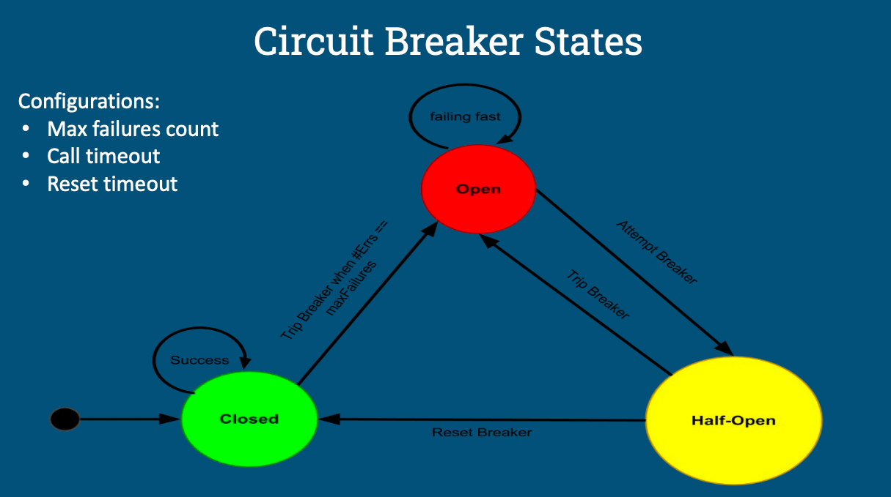

# Proxy Server Circuit Breaker

This circuit breaker is to be used specificially with HTTP servers.

## Circuit Breaker Pattern

The circuit breaker pattern is used to avoid adding additional load on failing services.

It works like a traditional circuit breaker. When a service is down and the calls to it are either failing or timing out, the circuit breaker will trip/open. A max failure count threshold is used to determine when the circuit breaker should trip.

Every failed call or timeout (based on call timeout threshold) will increment the failure count. When the failure count crosses the max failure count then the circuit will trip and enter the `OPEN` state.

Any call made to the service while the circuit is open will result in the call not being made and a `CircuitBreakerOpenException` being thrown.  
After the configured reset timeout the circuit will enter the `HALF_OPEN` state. In this state the call a call to the service will be made and if it goes through then the circuit will enter the `CLOSED` state and reset the failure count.  
A failure in this state will cause the circuit breaker to trip again and enter the `OPEN` state.

## Implementation

We decided to implement the circuit breaker using a decorator class.

The `CircuitBreaker` decorator class is used to wrap the service call and maintains state of the circuit breaker. This state holds the configuration (max failure count, call timeout, reset timeout), state of the circuit breaker (OPEN, HALF_OPEN, CLOSED) and the failure count.

## Proxy Server
